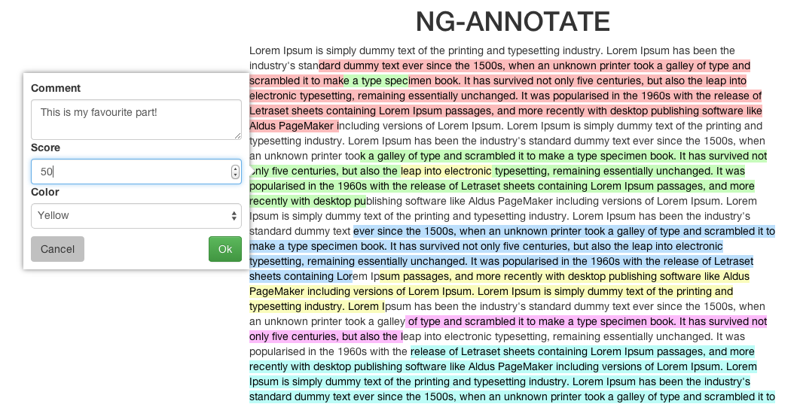

# ng-annotate-text

ng-annotate-text is a library to annotate texts in AngularJS.

## Demo

[Try a demo of ng-annotate.](http://digiexam.github.io/ng-annotate-text/)

## Attributes

Attribute | Default value | Description
--- | --- | ---
text |   | The text to be annotated
annotations |  | Annotations to load
readonly | false | No new annotations can be made and existing annotations can't be edited
popup-controller |  | Controller to apply to the popup
popup-template-url |  | Url to the popup template
tooltip-controller |  | Controller to apply to the tooltip
tooltip-template-url |  | Url to the tooltip template
on-annotate |  | Function called when an annotation is saved, with the annotation passed as the first attribute
on-annotate-delete |  | Function called when an annotation is deleted, with the annotation passed as the first attribute
on-annotate-error |  | Function called when an error is caught, with the error passed as the first attribute
on-popup-show |  | Function called when the popup is shown
on-popup-hide |  | Function called when the popup is hidden 
popup-offset | 10 | Position the popup editor away form its annotation and the window edges by this many pixels

## Event listeners

Event | Description
--- | ---
ngAnnotateText.clearPopups | Clears any open popup or tooltip

## Errors passed to the annotation error callback

Error | Description
--- | ---
NG_ANNOTATE_TEXT_NO_TEXT_SELECTED | The user clicked the text but no text were selected
NG_ANNOTATE_TEXT_PARTIAL_NODE_SELECTED | The selection did not start and end in the same element

## Getting started with development

1. Install NodeJS ([nodejs.org](http://nodejs.org/))
2. Install Gulp globally: `npm install -g gulp`
3. Fork the repo and clone it. ([How to do it with GitHub.](https://help.github.com/articles/fork-a-repo))
4. Go into the project folder: `cd ng-annotate-text`
5. Install the project dependencies: `npm install`
6. Build the project files: `gulp`
  * Build them whenever they change: `gulp watch`

To make development of ng-annotate-text easier you can check out the `master` branch in one directory and the `gh-pages` branch in another, then symlink the dist files from `master` into the `lib` directory in `gh-pages`, and change the includes in `index.html` to use those versions.

## Browser compatability

Chrome, Firefox, Safari and IE9+

Autoprefixer rule: last 2 versions, ie >= 9, Firefox ESR

## License

Licensed under CC-BY-NC

https://tldrlegal.com/license/creative-commons-attribution-noncommercial-(cc-nc)

Copyright (C) 2014 DigiExam
